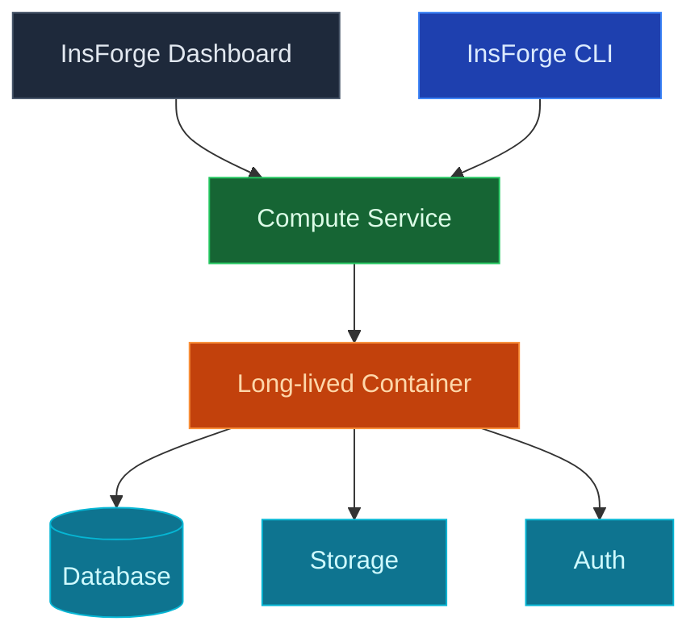

使用 InsForge 自訂運算在您的專案旁執行長期容器：佇列背景工作、後臺處理器、AI 推理迴圈、websocket 伺服器、網頁爬蟲、任何需要保持執行的東西。容器使用函式會使用的相同認證附加到您的專案的資料庫、儲存和驗證。

<Note>
  **只需要處理請求？** 對請求/回應工作和短工作使用 [Edge Functions](/core-concepts/functions/overview)。自訂運算適用於需要連續執行的流程。
</Note>

## 功能

### 容器部署

將任何 Docker 映像推送到 InsForge，它就會執行。使用來自您的存放庫的 `Dockerfile` 或指向登錄上的預建映像。無需學習專有的建置管道。

### 專案連結認證

容器作為環境變數接收 InsForge 專案 URL、服務角色 JWT 和 S3 儲存認證。連接到 Postgres、呼叫 SDK 並讀取物件，無需配置任何東西。

### 縮放

對於單個背景工作執行一個執行個體，或對無狀態工作負載進行水平縮放。記憶體、CPU 和複本計數可以按服務配置。

### 日誌

每個容器的結構化日誌，可按服務和時間範圍查詢。在儀表板、CLI 或 MCP 中追蹤，無需 `kubectl exec` 進入任何東西。

### 祕密和環境變數

為每個服務設定環境變數和祕密，與您的邊緣函式祕密分開。不需重新部署即可輪換。

## 自行託管：啟用 compute

Custom Compute 把您的容器跑在 [Fly.io](https://fly.io) 上。在 InsForge Cloud 上這部分完全代管，您無需設定。自行託管時，您使用自己的 Fly 帳號，透過 `.env` 中的兩個環境變數啟用 compute：

- `FLY_API_TOKEN`：Fly.io API token，用 `fly tokens create org` 產生。InsForge 用它來建立和管理您的 compute 容器。
- `FLY_ORG`：您的 Fly organization slug，用 `fly orgs list` 查看。容器會建立在此 org 之下。

兩者都必填。只有 token 而沒有 org，就沒有可認證的對象；只有 org 而沒有 token，則無法呼叫。設定完成後重新啟動容器。兩者齊備之前，compute 端點都會回傳 `503 COMPUTE_NOT_CONFIGURED`。

## 下一步

- 設定 [CLI](/quickstart) 以連結您的專案（建議的路徑）。
- 如果您只需要請求/回應，請查看 [Edge Functions](/core-concepts/functions/overview)。
