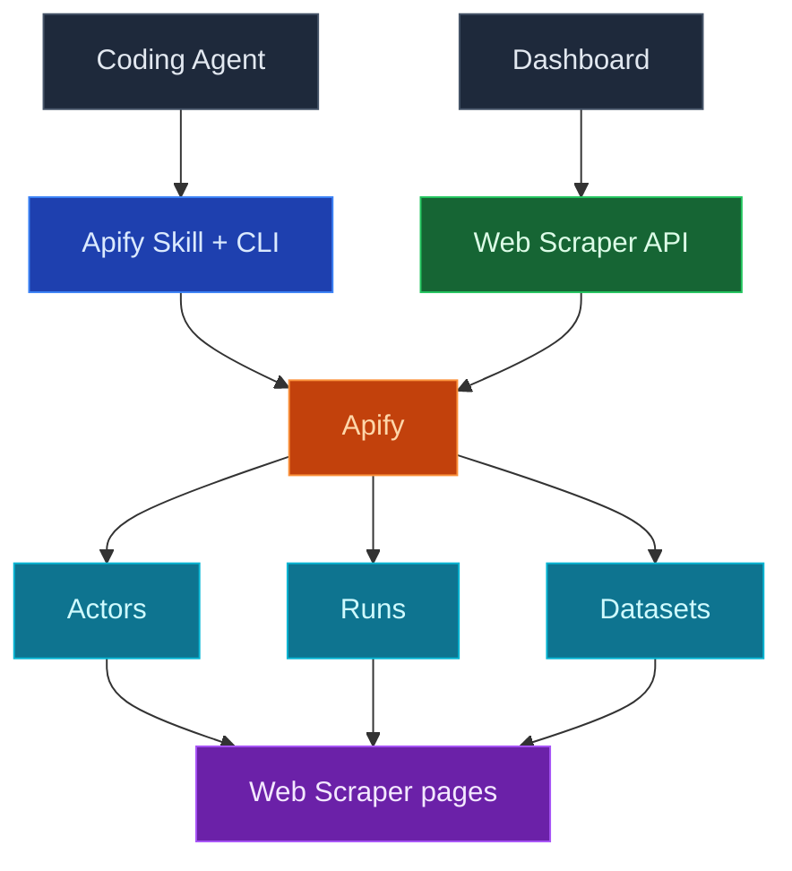

使用 InsForge Web Scraper 让您的编码代理实时访问外部数据：只需连接一次您自己的 Apify 账户，您的代理就可以按需运行爬虫（Apify 称之为 actor），同时仪表盘会显示您的 actor、运行历史和爬取到的数据集，无需离开 InsForge。

连接一次 Apify，然后将爬取提示粘贴到您的编码代理中。代理使用您由 InsForge 托管的 Apify 令牌进行身份验证，为任务挑选合适的 actor，并返回结果。

<Frame caption="Web Scraper 仪表盘：已连接的 actor 及其最近一次运行时间和总运行次数。">
  
</Frame>

<Note>
  Apify 始终是 actor、运行记录和数据集的权威来源。InsForge 展示了用于日常检查的一个精简子集，对于超出该范围的内容，会深链到 Apify 控制台。Web Scraper 集成在 InsForge Cloud 和自托管部署上均可使用；两者只是连接 Apify 的方式不同。
</Note>



## 功能

### 连接 Apify

在仪表盘中的 Web Scraper 页面连接 Apify。接下来的流程取决于 InsForge 运行在哪里。

在 InsForge Cloud 上只需一键：InsForge 会引导您完成 Apify OAuth 流程，在服务端存储凭证，并为您持续刷新访问令牌。

自托管部署前面没有 OAuth 中介，因此需要您自带凭证。在 Apify 控制台的 **Settings → Integrations** 中创建一个 API 令牌，将其粘贴到 Web Scraper 页面，InsForge 会把它加密存放在您自己后端的秘密存储中。使用 CLI 的 `insforge webscraper apify connect --token <token>` 也能完成同样的事。

无论采用哪种方式，令牌都不会出现在您的代码仓库或前端产物中；代理和函数在需要时会从后端获取一个实时令牌。

<Warning>
  自托管时，请签发一个权限范围尽量收窄的 Apify 令牌，而不是覆盖整个账户的令牌。`GET
  /api/webscraper/apify/token` 会把已存储的令牌原样返回给管理员调用方，代理路径正是借此登录
  Apify CLI；因此该令牌在 Apify 上能做的事，等同于一个 InsForge 管理员密钥能做的事。
</Warning>

### 通过您的编码代理进行爬取

连接完成后，空状态界面会提供一段爬取提示，您可以将其粘贴到您的编码代理中：

```
Use the insforge webscraper apify skill to scrape <what you want> and return the results.
```

在该提示背后，`npx @insforge/cli webscraper apify login` 会获取您由 InsForge 托管的 Apify 令牌，以无头方式（无需浏览器 OAuth）对本地 Apify CLI 进行身份验证，并安装 Apify 代理技能。此后，代理会从 Apify Store 中挑选一个 actor，启动运行，并读回结果。

### Actors

您最近使用过或创建的 actor，包含其最近运行时间和总运行次数。每一行都会深链到 Apify 控制台，以进行完整的 actor 配置。

### Runs

最近的爬虫执行记录，包含状态（成功、失败、运行中）、开始时间以及以美元计的费用。无需打开 Apify，即可快速核实"昨晚的爬取任务是否成功执行，花费了多少"。

### Dataset

由您的运行产生的数据集，包含条目数量、创建时间以及产生该数据集的 actor。深链到 Apify 存储，您可以在其中查看或导出条目。

### 将爬取到的数据存入您的数据库

爬取结果默认存放在 Apify 数据集中；除非您需要，否则不会写入您项目的 Postgres 数据库。对于小规模爬取，您的代理可以直接返回结果。对于任何您想要保留或按计划刷新的内容，可以让代理部署一个[边缘函数](/core-concepts/functions/overview)或[计算服务](/core-concepts/compute/overview)，从 Apify 获取数据集并将行数据插入或更新到表中。

### 设置与断开连接

Web Scraper 配置对话框（侧边栏中的齿轮图标）显示已连接的 Apify 账户、套餐和数据保留策略，链接到 Apify 控制台，并允许管理员断开连接。断开连接只会阻止 InsForge 使用您的 Apify 凭证；在自托管部署上，它会直接从您的秘密存储中删除已保存的 API 令牌。您的 Apify 账户、actor 和数据集将保持完整，您随时可以重新连接。

## 概念

<CardGroup cols={2}>
  <Card title="Apify actor" icon="robot" href="https://docs.apify.com/platform/actors">
    每次运行背后的无服务器爬虫，从现成的 Store actor 到您自己的 actor 皆可。
  </Card>

  <Card title="Apify 存储" icon="database" href="https://docs.apify.com/platform/storage/dataset">
    数据集如何存储爬取的条目，以及如何通过 API 导出或获取它们。
  </Card>
</CardGroup>

## 基于此构建

<CardGroup cols={2}>
  <Card title="InsForge CLI" icon="terminal" href="/quickstart">
    `npx @insforge/cli webscraper apify connect` 将您的项目关联到 Apify，然后登录您的本地代理。
  </Card>

  <Card title="Apify Store" icon="store" href="https://apify.com/store">
    数以千计针对常见目标的现成 actor，从 Google Maps 到社交平台应有尽有。
  </Card>

  <Card title="Apify API 客户端" icon="js" href="https://docs.apify.com/api/client/js/">
    从您的边缘函数或计算服务中调用 actor 并读取数据集。
  </Card>
</CardGroup>

## 下一步

- 打开仪表盘中的 Web Scraper 页面，点击 **Connect Apify**；若为自托管，则在此粘贴您的 Apify API 令牌。
- 将爬取提示粘贴到您的编码代理中，并告诉它您想要爬取的内容。
- 当某次爬取值得保留时，让您的代理通过[边缘函数](/core-concepts/functions/overview)或[计划任务](/core-concepts/functions/schedules)将数据集存入表中。
